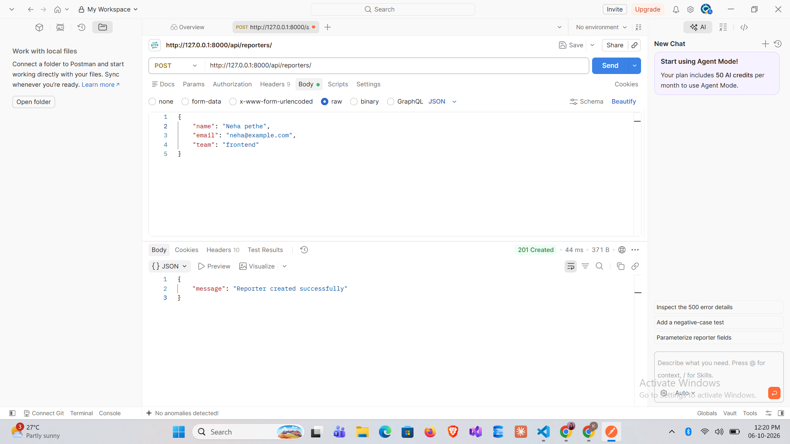
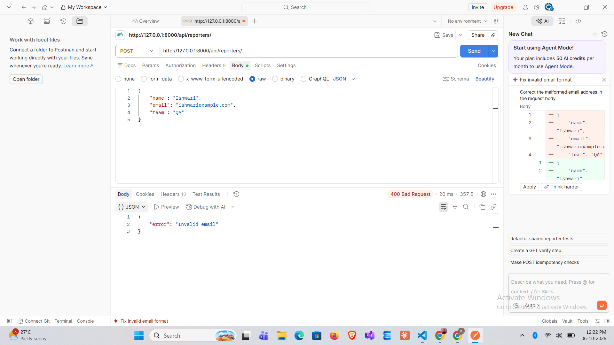

# DevTrack Assignment 1

A small Django project implementing simple issue and reporter management via REST endpoints backed by JSON files. This project is backend API for tracking engineering issues. Engineers report bugs, assign priorities, and track status similar to a stripped-down GitHub Issues. Every engineering team tracks work bugs filed, priorities set, statuses updated. DevTrack is a minimal backend for this.


## Requirements

- Python 3.11+ (project used 3.14 in dev)
- Virtual environment (recommended)
- Dependencies from `requirements.txt`

## Setup & Run

1. Create and activate a virtual environment:

```powershell
python -m venv venv
.\venv\Scripts\Activate.ps1
```

2. Install dependencies:

```powershell
pip install -r requirements.txt
```

3. Run the development server:

```powershell
python manage.py runserver
```

Server will be available at `http://127.0.0.1:8000/`.

## Endpoints

- `GET /api/reporters/` — list all reporters
- `GET /api/reporters/?id=<int>` — get reporter by integer `id`
- `POST /api/reporters/` — create a reporter. JSON body: `{ "id": 1, "name": "Alice", "email": "alice@example.com", "team": "QA" }`

Notes: Endpoints are based on file-backed storage in `reporters.json` and `issues.json` in the project root.

## Example Postman screenshots

Success (http://127.0.0.1:8000/api/reporters):



Failure (http://127.0.0.1:8000/api/reporters)



Note: Other screenshots are present in `docs/screenshots` folder

## Design decision

I used simple JSON-file-backed storage (instead of a database) to keep the assignment minimal and avoid database setup. This makes the project easier to run for reviewers: no migrations or DB setup are required, and the behavior is transparent via the `reporters.json` and `issues.json` files. The trade-off is lack of concurrency safety and scalability, which is acceptable for this small assignment.

---
